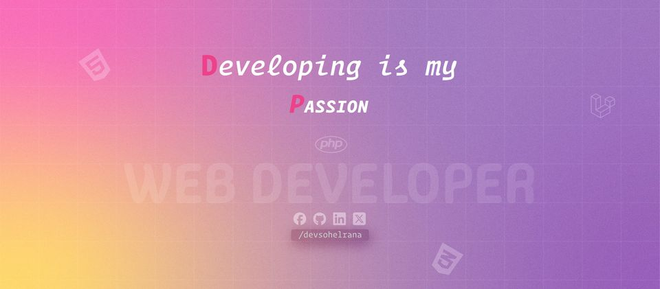

## Hi there my gorgeous friend 

I'm Sohel Rana, a Full Stack Web Application Developer from  Bangladesh. I Spend most of time coding outstanding projects. Coding is my passion.

:coffee: &emsp;Connect with me!

## Things I code with

### Design Tools

### Frontend Tools

  

### Backend Tools

### Database Tools

### Work Space

### Version Control

